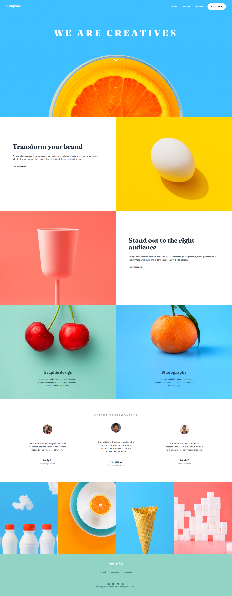

# Sunnyside Agency Landing Page

## Links

- [Live demo]()

## About
This is a solution to the Sunnyside agency landing page challenge from [Frontend Mentor](https://www.frontendmentor.io/challenges/sunnyside-agency-landing-page-7yVs3B6ef).

Users should be able to:

- View the optimal layout for the site depending on their device's screen size
- See hover states for all interactive elements on the page

## Built with:
- Semantic HTML5 markup
- CSS custom properties
- CSS Flexbox/Grid
- SASS/SCSS
- Javascript
- Compiled with Gulp